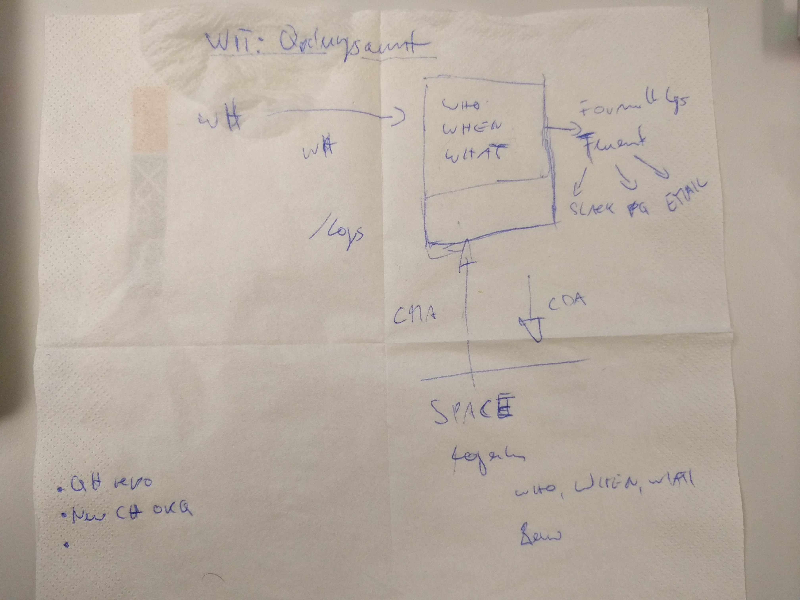

Ordnungsamt - Simple Audit Logging for Contentful with Contentful
-----------------------------------------------------------------

At Grumpy BOFH Inc we needed an audit log of who has been doing what with our precious content. The chosen solution was to configure webhooks on the Space where content is managed, and use this to populate a second restricted Space with a record of changes. Our detailed design document is as follows:

The webhooks are consumed by a Sinatra app, which massages the metadata from the webhook and spits it out to two destinations:

1. Using the CMA, each event is recorded in the Audit Log space
1. Events are also logged to a [Fluentd](http://www.fluentd.org/) instance so we can use existing Fluentd plugins to alert via Slack or Email, etc.

Things we came up against:

* Publish/Unpublish events do not log `sys.updatedBy` with the user key, this is present on all other events
* We can log the user key, but currently there is no way to discover the associated user ID without opening a Support ticket with Contentful.
* Publish/Unpublish "createdAt" timestamps correspond to the moment of publishing / deletion from the public index, which is confusing
* The README for contentful/contentful-management.rb is somewhat confusing, e.g. Content Types are described after Entries, in general it would be good to start with a minimal but complete example at the top to show how it works.
* We tried storing the raw data from the webhook in a JSON field; this broke the Web App - it couldn't handle JSON inception. The APIs were fine with it though.
* Fluentd has some fancy capabilities and is extensible with Ruby plugins - it should be feasible to write an `out_contentful` plugin to store events in Contentful directly in Fluentd, and use [in_http](http://docs.fluentd.org/articles/in_http) with its built-in JSON parsing with [record-transformer](http://docs.fluentd.org/articles/filter_record_transformer) to process the webhooks
* Content Discovery apps did not seem to work very well, at least with our (relatively simple) content model.
